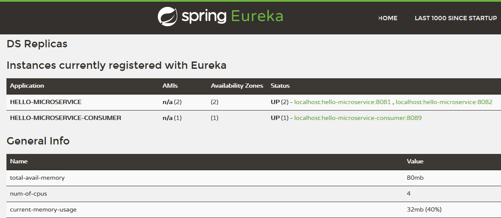

# spring-cloud-service-registry
Java, Spring, Microservices, Service Registration and Discovery, Load Balancing

__spring-cloud-service-registry-netflix-eureka-server__  

  
>INFO 15720 --- [       Thread-9] o.s.c.n.e.server.EurekaServerBootstrap   : Setting the eureka configuration..  
  INFO 15720 --- [           main] o.s.b.w.embedded.tomcat.TomcatWebServer  : Tomcat started on port(s): 8761  
  INFO 15720 --- [nio-8761-exec-4] c.n.e.registry.AbstractInstanceRegistry  : Registered instance HELLO-MICROSERVICE/localhost:hello-microservice:8081 with status UP  
  INFO 15720 --- [nio-8761-exec-7] c.n.e.registry.AbstractInstanceRegistry  : Registered instance HELLO-MICROSERVICE/localhost:hello-microservice:8082 with status UP  
  INFO 15720 --- [nio-8761-exec-6] c.n.e.registry.AbstractInstanceRegistry  : Registered instance HELLO-MICROSERVICE-CONSUMER/localhost:hello-microservice-consumer:8089 with status UP  
  

__spring-cloud-service-registry-netflix-eureka-service__  
Run few instances from the same microservice:
> mvn spring-boot:run -Dspring-boot.run.arguments="--server.port=8081"  
  mvn spring-boot:run -Dspring-boot.run.arguments="--server.port=8082"  

__spring-cloud-service-registry-netflix-eureka-service-consumer__  
The load balancer is calling different instance each time:
  >Found 2 instances of microservice [hello-microservice]; Now consuming = http://localhost:8081/hello; Call result = Hello from: hello-microservice  
  Found 2 instances of microservice [hello-microservice]; Now consuming = http://localhost:8082/hello; Call result = Hello from: hello-microservice  
  Found 2 instances of microservice [hello-microservice]; Now consuming = http://localhost:8081/hello; Call result = Hello from: hello-microservice  
  Found 2 instances of microservice [hello-microservice]; Now consuming = http://localhost:8082/hello; Call result = Hello from: hello-microservice  
  ...

